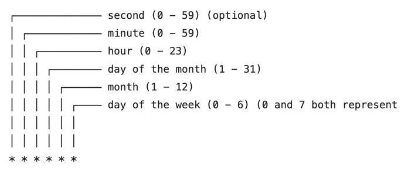

## Learning with https://www.youtube.com/@anonystick

## Todo list

- [x] Swagger or OpenApi
- [x] Logger
- [x] I18n
- [x] Mongodb
- [x] Caching with redis
- [x] Unit test
- [x] RabbitMq
- [x] Email
- [x] Cron job
- [x] Unit test
- [x] Security with public key, private key, token jwt
- [ ] Test benchmark with autocannon
- [ ] Notify with firebase or socketIo
- [ ] Upload file with S3 or MinIO
- [ ] Dockerfile, docker-compose for dev and test
- [ ] Deployment with jenkins or circleCI

## Setup lib project
    - express
    - helmet
    - bcrypt": "^5.1.0",: encrypt, decrypt
    - body-parser": "^1.20.2",: config parser request body
    - compression": "^1.7.4",: nen request response
    - cookie-parser": "^1.4.6",: config parser request body
    - dotenv": "^16.0.3",: cau hinh doc file enviroment .env
    - helmet": "^6.0.1",: Che dau thong tin stack phia server, thong tin rieng tu...
    - html-to-text": "^9.0.4",: convert html to text
    - i18n": "^0.15.1",: cau hinh da ngon ngu
    - jsonwebtoken": "^9.0.0",: thu vien jwt
    - lodash": "^4.17.21",
    - mongoose": "^6.9.2",: connect mongodb
    - morgan": "^1.10.0",: thu vien in ra cac log khi mot nguoi dung request xuong
    - nodemailer": "^6.9.1",: cho phep send mail
    - slugify": "^1.6.6",: convert text to slug, example: ao khoac nam -> ao-khoac-nam
    - swagger-ui-express": "^4.6.2": config swagger
    - yaml": "^2.2.1": config swagger
    - chai
    - nodemon
    - redis: using cache redis

## Mongodb
    - Nhược điểm của cách connect cũ
    - Cách connect mới, khuyên dùng
    - Kiểm tra hệ thống có bao nhiêu connect
    - THông báo khi server quá tải connect
    - Có nên disConnect liên tục hay không?
    - PoolSize là gì? vì sao lại quan trọng?
    - Nếu vượt quá kết nối poolsize?
    - MongoDB Desing pattern
          - Polymorphic pattern
          - Attribute pattern
          - Bucket pattern
          - Outlier pattern
          - Computed pattern
          - Subnet pattern
          - Extended reference pattern
          - Approximation pattern
          - Tree pattern
          - Preallocation pattern
          - Document versioning pattenr
          - Schema versioning pattern


## Course series
    1 - Welcome, welcome, welcome -   

    • Course: Node.js B...  
    2 - Những folders và packages cần thiết khi khởi tạo Project! -
    
    • Section 2: Node.j...  
    3 - Connect MongoDB to Node.js Using Mongoose và 7 điều lưu ý  -
    
    • Section 3: Connec...  
    4 - Cách triển khai env cho các level khác nhau. -
    
    • Section 4: Lịch s...  
    5 - Sign-up Shop (1) -
    
    • Section 5: Api Si...  
    5 - Sign-up Shop (2) -
    
    • Section 5: Reup S...  
    6 - Middleware apikey and permissions -
    
    • Section 6:  Custo...  
    7 - Xử lý ErrorHandler trong API -
    
    • Section 7: Xử lý ...
### Handler auth
    https://github.com/madhums/node-express-mongoose-demo.git

### Api key
    `Lưu trữ key cung cấp cho các đối tác được truy cập vào hệ thống`

### Design Schema MongoDB - Polymorphic Pattern
    - 1document 1kb -> 50tr = 50gb

### Fulltext search in mongoDB
    [https://anonystick.com/blog-developer/full-text-search-mongodb-chi-mot-bai-viet-khong-can-nhieu-2022012063033379]

### Implement Swagger
    npm install swagger-ui-express swagger-jsdoc --save

### Cron job
    npm install node-cron --save


    const cron = require("node-cron");
    cron.schedule("*/15 * * * * *", function () {
        console.log("---------------------");
        console.log("running a task every 15 seconds");
    });

### Send mail
    npm install node-mailer pug html-to-text'

[chedule-cron-job-in-node](https://reflectoring.io/schedule-cron-job-in-node/)

### Send notify - Firebase
    ----

### Deployment docker + nginx + kubernetes
    step 1: Create Dockerfile
``` docker build -t [name image]:[tag version] . ```
``` docker build -t ecommerce-service:1.0 . ```
        - Để bu Docker image ta dùng command docker build
        - Option -t để chỉ là đặt tên Image
        - Dấu . ể ch cho docker hãy build image với context ở folder hiện tại này cho tôi. Docker sẽ tìm ở folder hiện tại Dockerfile và build
    step 2: Create docker-compose    
        - Version của docker-compose
        - Tiếp theo services, bên trong services ta sẽ định nghĩa các thành phần cần thiết cho project của bạn
        - Ở trong service app ta có trường restart là 'unless-stopped', ý bảo là tự động chạy service này trong mọi trường hợp,
            nhưng nếu service này bị dừng bằng tay, hoặc đang chạy m gặp lỗi bị dừng thì đừng restart nó.
        - ports: mapping port môi trươn docker ra môi tr ngoài, bên trái l môi trường gốc bên ngoài, bên phải là port container
``` docker-compose up -d ```
``` docker-compose down ```
    step 3: Check console
        - Đầu tiên một network mặc định (default) sẽ được tạo ra, và tất cả các services sẽ đợc join vào chung 1 network ngày, vả chỉ các service ở trong network mới giao tiếp được với nhau.
        - Tiếp theo một container tên xxx được tạo từ image. Tên container được tự động chọn để không bị trung lặp
        - Cuối cùng container được chạy thì dòng code CMD ở cuối file Dockerfile sẽ được chạy.

### S3
    ----

### Caching with redis
    npm i redis@3.1.1 --save

### Message broker - ActiveMQ


### Logger
    npm i winston express-winston winston-mongodb
    npm i winston-daily-rotate-file --save
[Logger Nodejs](https://anonystick.com/blog-developer/logger-nodejs-la-gi-su-dung-winston-la-phai-chuyen-nghiep-nhu-the-nay-202010099590776)

### Unit test with chai + mocha
    npm i chai chai-http mocha mocha-suppress-logs --save

### Upload file to S3 or MinIO
    npm i aws-sdk --save

### Push error to discord
    npm install discord.js

### Test benchmark with auto cannon
[Auto Cannon](https://www.youtube.com/watch?v=_tBWQ8JaFOs)